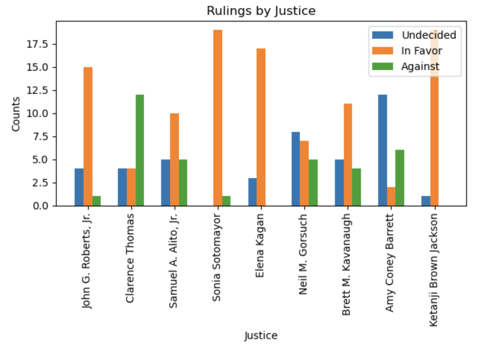
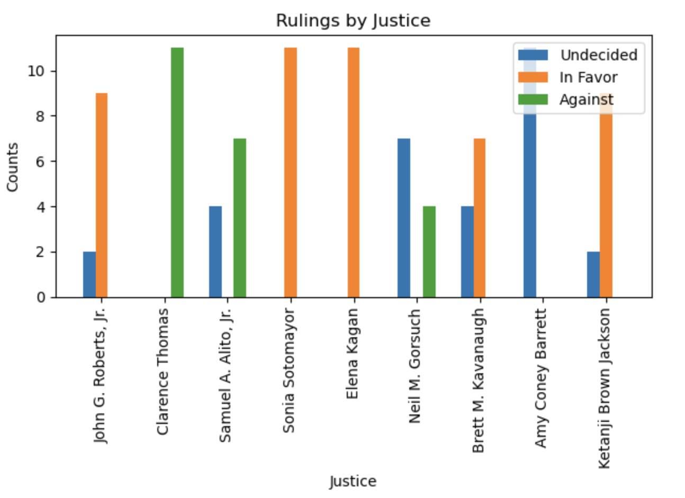

# Supreme Court Opinion experiemnt
The gist here was to see if GPT could adopt a persona and make decisions like the human would. 

As a simple experiment, this notebook takes a legal question and asks opinions of all supreme court justices, individually. The same question can be asked many times so we can get some statistics around consistency of answers. 

There are many things to explore, including how much does model matter? How does temperature affect results? How much randomness is involved? Prompt?

gpt-3.5-turbo results

gpt-4 results

There's a path of exploration here, it starts with prompts, moves to embeddings, then eventually fine-tuning. Of course, it's easier to craft a prompt than to fine-tune a model so why not start there? 